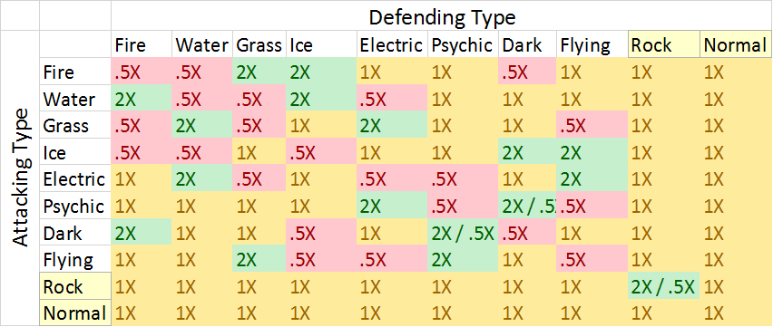

Type Effectiveness
===========================================

Single Type Effectiveness Table
---------------------------------------------------------------------------

Battler Type Mechanics
---------------------------------------------------------------
All battlers have a fixed base type that does not change.

The trainer chooses their off-type based on the first move they learn, at level 2 (or the next level up in the case of a wild battler).

At level 2, three new moves will be available to learn, each of a different type.

The move chosen will determine the battler's off-type from that point on.

The three move types available to a battler follow a specific pattern:
Move 1) One of the natural counter (if any) types to the battler (constant).
Move 2) An off-type move (not countered) to the battler (varies).
Move 3) The same type as the battler (constant), this allows for single-type stacking.

Type options for the starting battlers (for reference):
Charmander (Fire) (Grass, Flying, Fire)
Squirtle (Water) (Fire, Ice, Water)
Bulbasaur (Grass) (Water, Electric, Grass)

Double-Typed Battlers
---------------------------------------------------------------------------
Unlike Pokemon, in order to provide a more consistent and balanced experience, every battler in MonsterBattles has exactly two types.
There are a total of 8 types, and each type is weak/strong against exactly 2 other types. (2 Tentative types that don't follow this rule, the balance behind these types would be no battler of this type would get the advantage of a double type.)
For the effectiveness of dual-typed battlers, all strengths and weaknesses are combined additively.

| For example, a grass-ice type battler:
| Grass is weak to Fire & Flying
| Ice is weak to Fire & Water
| So, a grass-ice type is weak (2X damage) to Flying & Water
| And helpless (4X damage) to Fire
| The same mechanic applies to resistances as well 
| (damage taken from a move type the battler is strong against)
| In the case of a grass-ice battler,
| Grass is strong against Water & Electric
| Ice is strong against Dark & Flying
| So a grass-ice type is strong against:
| Water, Electric, Dark and Flying
| 
The tradeoffs of dual typing is very clear, then, extra type coverage at the expense of a strong type weakness in most cases

Single-Typed Battlers
--------------------------------------------------------------------------------
Since the trainer is able to choose a battler's secondary type, one available option is to double-down into the battler's base type. IE A base water type pokemon chooses water as it's off-type.

This effectively gives the pokemon 4X effectiveness against it's strengths, but 4X effectiveness against it's weaknesses as well. 

This is useful for an all-out offensive battler/team, where your battler's only intended targets are it's natural strengths.